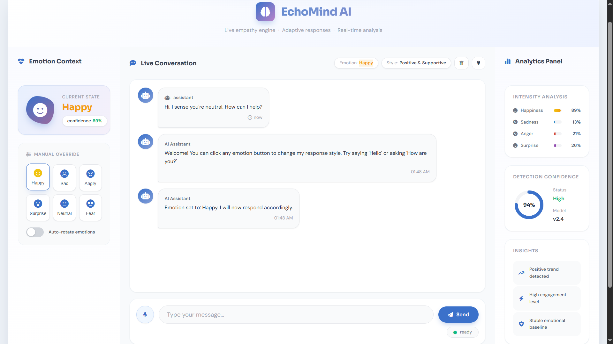
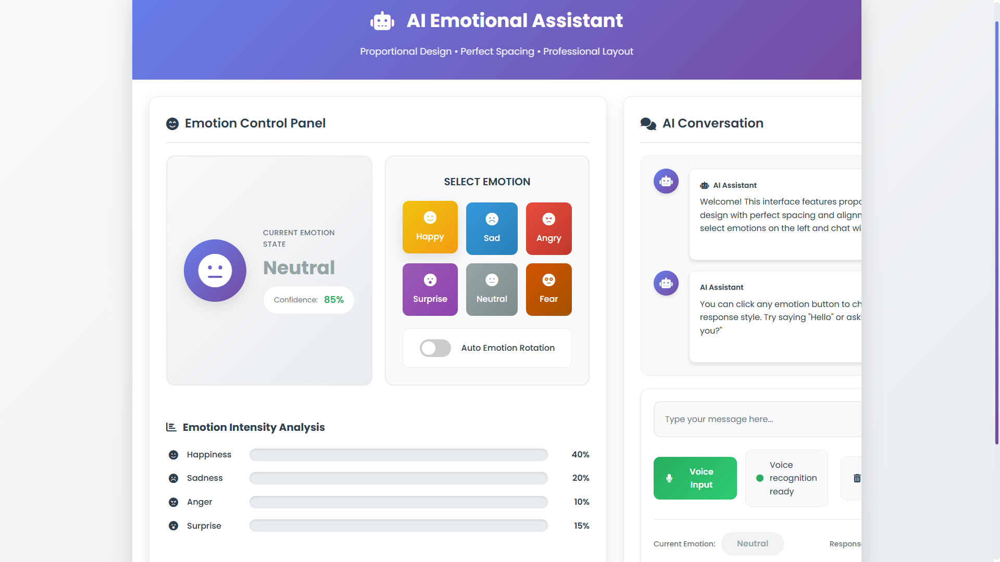
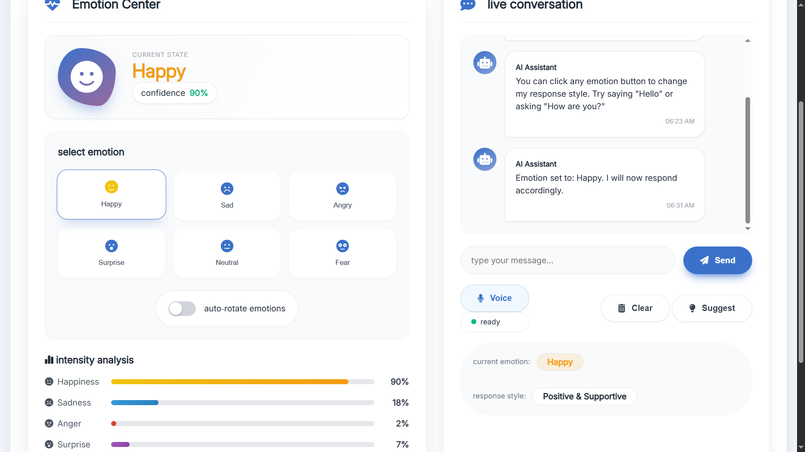

# EchoMind AI - Emotional Intelligence Assistant


 


<p align="center">

</p>

_EchoMind AI - Professional Interface with Emotional Intelligence_

A sophisticated AI Emotional Assistant that combines emotion detection
with intelligent conversation. The system adapts its responses based on
detected emotional states, providing empathetic and contextually
appropriate interactions across all devices.

## 📱 Live Demo

🌐 **Live App**: <https://echomind-ai-0uuh.onrender.com>

## ✨ Features

### 🎭 **Emotional Intelligence**

- **6 Emotion States** - Happy, Sad, Angry, Surprise, Fear, Neutral
- **Real-time Emotion Display** - Visual feedback with animated icons
- **Emotion Intensity Bars** - Visual representation of emotional
  states
- **Auto-Emotion Rotation** - Demonstration mode with cycling emotions

### 💬 **Smart Conversation**

- **Context-Aware Responses** - AI adapts tone based on emotional
  context
- **Mobile-Optimized Chat** - Enhanced experience for mobile users
- **Rich Response Library** - Jokes, facts, and engaging content
- **Conversation Suggestions** - Topic prompts for better engagement

### 🎤 **Voice Capabilities**

- **Voice Input** - Speech recognition for hands-free interaction
- **Emotion-Based Voice Output** - Voice pitch/rate adapts to emotion
- **Mobile-Safe Speech** - Optimized for Android and iOS devices
- **Multiple Voice Options** - Premium voice selection (Google UK
  Female, Microsoft Hazel)

### 🎨 **Living Interface**

- **3D Animations** - Morphing shapes and floating particles
- **Glass Morphism** - Modern frosted glass effects
- **Fully Responsive** - Perfect on desktop, tablet, and mobile
- **Smooth Transitions** - Bouncy animations and hover effects

### 📊 **Emotion Analysis**

- **Intensity Tracking** - Real-time emotion percentage bars
- **Confidence Display** - AI confidence level for detected emotion
- **Response Style Indicator** - Shows current AI communication style

## 🚀 Quick Start

### Prerequisites

- Node.js (v14 or higher)
- npm or yarn
- OpenRouter API key (optional, for enhanced AI responses)

### Installation

1.  **Clone the repository**

    ```bash
    git clone https://github.com/yourusername/echomind-ai.git
    cd echomind-ai
    ```

2.  **Install dependencies**

    ```bash
    npm install
    ```

3.  **Set up environment variables**

    ```bash
    cp .env.example .env
    # Edit .env and add your OpenRouter API key (optional)
    ```

4.  **Start the server**

    ```bash
    npm start
    # or for development with auto-reload
    npm run dev
    ```

5.  **Open your browser**

        http://localhost:3000

## 📱 Mobile Support

EchoMind AI is fully optimized for mobile devices:

- Touch-Friendly UI - Large buttons and touch targets
- Mobile-Optimized Responses - Shorter, engaging replies
- Safe Speech Synthesis - Works on Android and iOS
- Responsive Layout - Adapts to any screen size

## 🏗️ Architecture

    EchoMind-AI/
    ├── server.js
    ├── public/
    │   ├── index.html
    │   ├── style.css
    │   └── script.js
    ├── .env
    ├── package.json
    ├── README.md
    └── VERSION_LOG.md

## 🔧 Configuration

### Environment Variables

| Variable           | Description                 | Required |
| ------------------ | --------------------------- | :------: |
| OPENROUTER_API_KEY | API key for OpenRouter AI   |   Yes    |
| PORT               | Server port (default: 3000) |   Yes    |

_Without API key, the system uses enhanced local responses_

## 📊 Version History <a src='./VERSION_LOG.md'> Version Logs </a>

### Version Evolution

<table>
<tr>
<td align="center" width="33%">
<h3>v1.0.0</h3>

<p><strong>Initial Release</strong><br/>Basic emotion detection interface</p>
</td>
<td align="center" width="33%">
<h3>v2.0.0</h3>

<p><strong>Major UI Overhaul</strong><br/>3D Effects & Glass Morphism</p>
</td>
<td align="center" width="33%">
<h3>v3.0.0</h3>

<p><strong>Mobile Optimization</strong><br/>Enhanced UI (Current)</p>
</td>
</tr>
</table>

### Release Timeline

- v3.0.0 - Mobile Optimization & Enhanced UI (Current)
- v2.1.0 - Voice Enhancement & Bug Fixes
- v2.0.0 - Major UI Overhaul with 3D Effects
- v1.1.0 - Voice Recognition & API Integration
- v1.0.0 - Initial Release

## 🎯 Usage Guide

### Desktop Users

- Click emotion buttons to change AI mood
- Type messages or use voice input
- Watch the 3D animations respond to interactions
- Enable auto-rotate for demonstration

### Mobile Users

- Tap emotion buttons (large touch targets)
- Use voice input for hands-free interaction
- Get shorter, optimized responses
- Enjoy smooth animations on any device

## 🤝 Contributing

1.  Fork the repository
2.  Create your feature branch
    (`git checkout -b feature/AmazingFeature`)
3.  Commit your changes (`git commit -m 'Add some AmazingFeature'`)
4.  Push to the branch (`git push origin feature/AmazingFeature`)
5.  Open a Pull Request

## 📄 License

This project is licensed under the MIT License.

## 🙏 Acknowledgments

- OpenRouter API for AI capabilities
- Font Awesome for premium icons
- Google Fonts for Inter and Poppins typography
- Render for seamless hosting

## 📧 Contact

Project Link: https://github.com/Sheeraz-bit/EchoMind-AI.git
Live Demo: https://echomind-ai-0uuh.onrender.com
Developer: https://link-holder.vercel.app/

---

<div align="center">

**Made with ❤️ for emotional intelligence**

_Built with vanilla JavaScript - no heavy frameworks_

</div>
